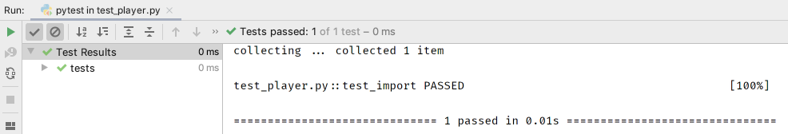

We've now seen a bit about writing and running a test using `pytest`. 
Let's start the process of writing our application.

# The Player

Lacrosse teams have, of course, players. 
We're going to make a `Player` class and write tests as we implement features.
This is known as "test-driven development" (TDD).

We previously made a placeholder file at `laxleague/player.py`.
Open that file and change it to have a placeholder class:

`embed:tutorials/visual_pytest/first_class/player.py`

## Note

Why the docstring? Later we'll show how PyCharm can give previews
of information during autocomplete. The information includes
docstrings, which helps you recall things without leaving your context.

# The Test

These tutorials are all about getting into the "flow". Lots of times I
resist: I'm tired, the problem I'm about to tackle is daunting, or I have a
lot on my mind.

As a self-hack, I write a simple test, just to see if the thing exists. It
is of modest value: it can later help show if a refactoring changed things.

Here's the updated `test_import` test function in `test_player.py`:

`embed:tutorials/visual_pytest/first_class/test_player.py`

Remember that PyCharm can help you [generate the import of `Player` as you type](../../../tips/generate-imports-while-typing/). 
You don't need to stop your flow, go to the top, and write the import. 
Instead, type `Pla` and hit `Ctrl-Space-Space` to autocomplete *and* add the import line at the top, in the correctly-sorted location, combined with any existing import of the module.

# Running

Let's run everything in the file (currently one test) by right-clicking in the editor and choosing `Run 'pytest in test_player.py'`.

PyCharm opens a tool window with the visual output of the test.
Our test passes again:

